

  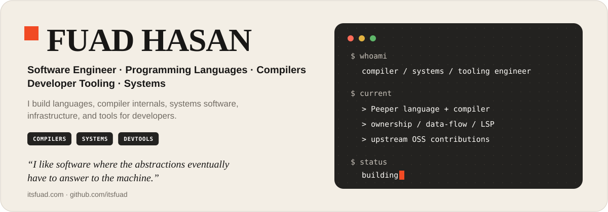

  <a href="https://itsfuad.com"><b>Website</b></a>
  &nbsp;·&nbsp;
  <a href="https://github.com/itsfuad"><b>GitHub</b></a>
  &nbsp;·&nbsp;
  <a href="https://github.com/sponsors/itsfuad"><b>Sponsor</b></a>

 

## Flagship

<a href="https://github.com/PeeperLanguage/compiler">
  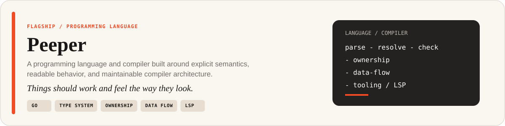
</a>

  <a href="https://github.com/PeeperLanguage/compiler"><b>Compiler</b></a>
  &nbsp;·&nbsp;
  language design
  &nbsp;·&nbsp;
  semantic analysis
  &nbsp;·&nbsp;
  ownership
  &nbsp;·&nbsp;
  data flow
  &nbsp;·&nbsp;
  LSP

 

## Selected Projects

<table>
<tr>
<td width="50%" valign="top"><a href="https://github.com/Ferret-Language/Ferret">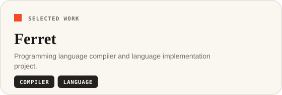</a></td>
<td width="50%" valign="top"><a href="https://github.com/itsfuad/Bornika">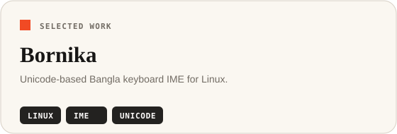</a></td>
</tr>
<tr>
<td width="50%" valign="top"></td>
<td width="50%" valign="top"><a href="https://github.com/itsfuad/octoload">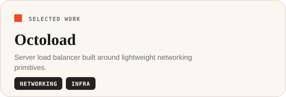</a></td>
</tr>
<tr>
<td width="50%" valign="top"><a href="https://github.com/itsfuad/SquirrelZip">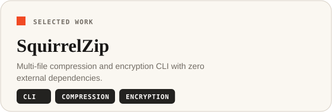</a></td>
<td width="50%" valign="top"><a href="https://github.com/itsfuad/FrostUI">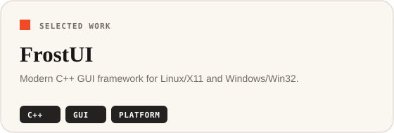</a></td>
</tr>
<tr>
<td width="50%" valign="top"><a href="https://github.com/BrainbirdLab/Poketab-Frontend">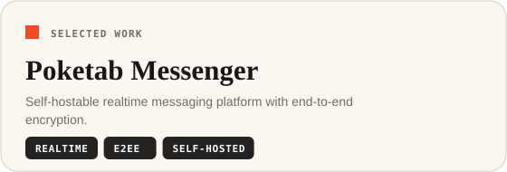</a></td>
<td width="50%" valign="top"><a href="https://github.com/BrainbirdLab/Poketune">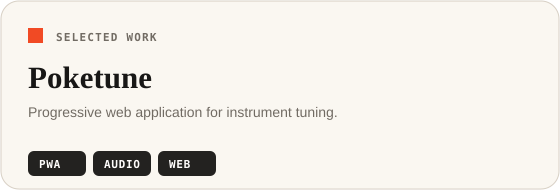</a></td>
</tr>
</table>

 

## Open Source

I contribute upstream when I find something worth fixing, simplifying, or extending.

<table>
<tr>
<td width="50%" valign="top"><a href="https://github.com/zed-industries/zed">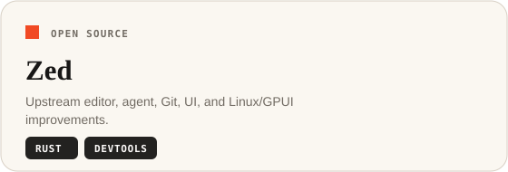</a></td>
<td width="50%" valign="top"><a href="https://github.com/scylladb/gocqlx">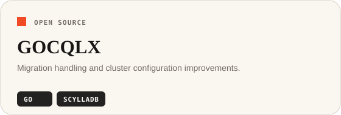</a></td>
</tr>
<tr>
<td width="50%" valign="top"><a href="https://github.com/d2lang/d2">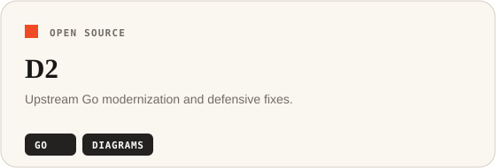</a></td>
<td width="50%" valign="top"><a href="https://github.com/socketio/socket.io-deno">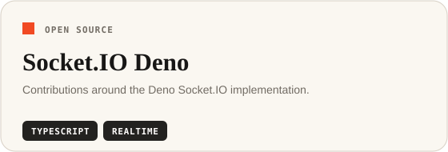</a></td>
</tr>
<tr>
<td width="50%" valign="top"><a href="https://github.com/EpicGames/lore">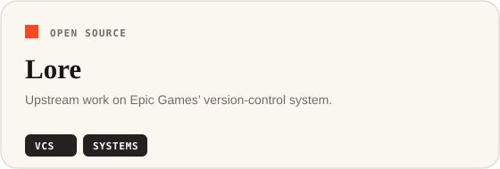</a></td>
<td width="50%" valign="top"><a href="https://github.com/tashfeenahmed/freellmapi">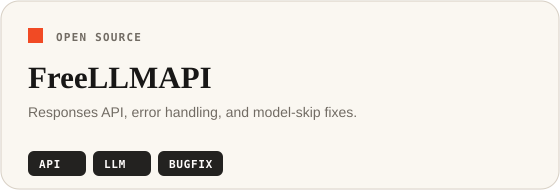</a></td>
</tr>
</table>

<b>What I tend to optimize for</b>

 

- explicit semantics and predictable behavior
- small, understandable abstractions
- centralized invariants rather than scattered special cases
- architecture that makes incorrect implementations harder to introduce
- codebases where a change does not require reconstructing the entire system in your head

> **How should the system be structured so the next change is difficult to get wrong?**

 

## Working Set

<table>
<tr>
<td><b>Languages</b></td>
<td>Go · C · Rust · C++ · TypeScript · Python · C# · Lua</td>
</tr>
<tr>
<td><b>Frontend</b></td>
<td>SvelteKit · Astro · React</td>
</tr>
<tr>
<td><b>Compiler work</b></td>
<td>Parsing · Semantic Analysis · Type Systems · Ownership · Data Flow · LSP</td>
</tr>
<tr>
<td><b>Systems</b></td>
<td>Linux · Networking · Databases · IPC · Platform Abstractions</td>
</tr>
<tr>
<td><b>Tooling</b></td>
<td>Git · Zed · VS Code · CMake</td>
</tr>
</table>

 

<a href="https://itsfuad.com">
  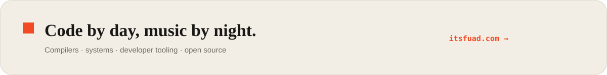
</a>
